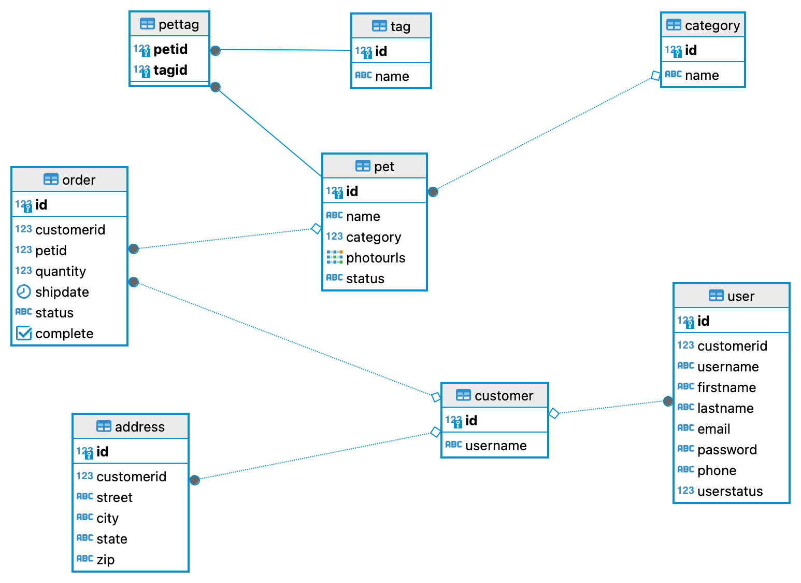
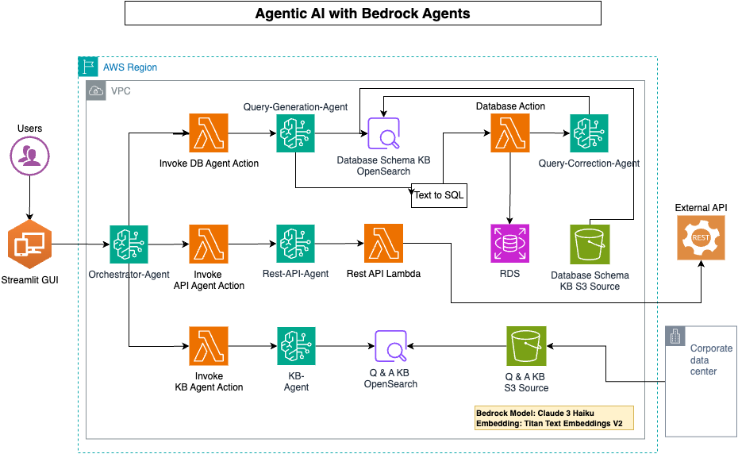

# Agentic Architecture using Bedrock Agents

Use this repository to deploy what you need to start the [Agentic AI with Amazon Bedrock Workshop](ihttps://catalog.us-east-1.prod.workshops.aws/workshops/4b5336de-e5b8-4b90-b1d8-dec31125cd95/en-US)

The workshop uses Amazon Bedrock Agents to build an application that can automate workflows and provide customer service for a retail pet store. The architecture leverages Amazon Bedrock Knowledge bases, AWS Lambda, 
S3, OpenSearch and Aurora RDS database. The agents can perform tasks given instructions in natural language, such as making database updates (text-to-sql) and answering questions from a knowledge base.

## Architecture Overview

### Components:
1. **Users and GUI**: End-users interact with the system through a graphical interface (Streamlit GUI), initiating queries and requests.
   
2. **Agents**:
   - **Orchestrator Agent**: User facing, responsible for task decomposition, planning, directing to other agents in executing subtasks.
   - **KB Agent**: Manages knowledge base interactions, with access to a Q&A KB sourced in OpenSearch and S3.
   - **Query Generation Agent**: Interacts with the Aurora RDS database to retrieve and update information.
   - **Query Correction Agent**: Automatically corrects SQL queries to ensure they are processed correctly. This agent helps improve the accuracy of database interactions by refining and adjusting gernrated SQL query as needed.
   - **API Agent**: Handles communication with external APIs

3. **AWS Lambda**:
   - **Rest API Lambda**: Executes API requests and interacts with RDS for database operations.
   - **Database Lambda**: Executes SQL, enabling dynamic database interactions. It also works alongside the Query Correction Agent to ensure queries are valid.

4. **Data Sources**:
   - **RDS**: The primary database.
   - **S3 Sources**: Data is stored in S3 for both the database knowledge base and Q&A knowledge base.
   - **Database Structure**: 

5. **Bedrock Model - Claude**: The system leverages Claude as the model for natural language understanding and interaction with the agents.

### Flow:
Users make requests through the GUI, which are handled by the corresponding agents. Depending on the request type (Database, API, or Knowledge Base), Bedrock will invoke appropriate AWS Lambda functions from the action group to process the request, interacting with the underlying data sources and generating responses that are then returned to the users. The Query Correction Agent ensures reivew the user question, existing SQL query and the query execution error to update the SQL query for Database Lambda.



## Project Structure

- `application/`
  - **streamlit/**: Contains the Streamlit app code, GUI to interact with the Orchestrator agent.
  - **agents/**: Holds individual agents, each with specific instructions and templates.
      - **kb-agent/**: Contains files related to the Knowledge Base Agent.
         - `agent_instruction.txt`: Instructions specific to the KB agent.
         - `Pet_Store_QnA_data.csv`: Sample Q&A data for the pet store knowledge base.
      - **orchestrator-agent/**: Contains files related to the orchestration logic.
         - `agent_instruction.txt`: Instructions specific to the Orchestrator Agent.
         - `orchestration_template.txt`: Template used for orchestration processes.
      - **query-correction-agent/**: Files used for the Query Correction Agent.
         - `agent_instruction.txt`: Instructions for correcting user queries.
         - `knowledge_base_instruction_for_agent.txt`: Knowledge base instructions for corrections.
         - `post_processing_template.txt`: Template for post-processing corrected queries.
      - **query-generation-agent/**: Files for generating queries.
         - `agent_instruction.txt`: Query generation instructions.
         - `knowledge_base_instruction_for_agent.txt`: Knowledge base guidance for generating queries.
      - **rest-api-agent/**: API interaction files.
         - `agent_instruction.txt`: Instructions for REST API agent interactions.
         - `dogbreed.yaml`: YAML configuration for a specific API related to dog breeds.
   - **lambdas/**: Contains Lambda function definitions.
      - `database-action/`: Actions and logic for database interactions.
      - `orchestrator-action/`: Actions related to orchestration.
      - `rest-api-action/`: Actions specific to API interactions.
  - **package_lambda.sh**: Script to create lambda deployment packages.

- `cicd/`
  - CI/CD-related resources,
  
- `images/`
  - **AgenticDemo.png**: The architecture diagram for the project.
  - **AgenticDemo.drawio**: The editable diagram file.

- `integration/`
  - **ddl.sql**: Database definition script, used by Query Generation Agent and Query Correction Agent
  - **data.sql**: Initial test dataset for the Aurora RDS database.
  - **petstore.yaml**: API specification in OpenAPI format for the external restful API.
  - **petstore_data_dictionary.md**: Data dictionary for the database, testing RAG comparing to the ddl.sql

## Setup Instructions

1. Create a bucket for the Lambda assets

In your AWS S3 console, create a bucket for your Lambda code artifacts. You can name it, for example,`my-lambda-assets-<your-aws-account-no>`

2. Clone the Repository:
   ```bash
   git clone https://github.com/aws-samples/agentic-architecture-using-bedrock.git
   cd agentic-architecture-using-bedrock
   ```

3. Edit the `ci-cd/template.yaml` Cloudformation template file and update the _MyAssetsBucketName_ parameter with your bucket name above. Replace the _KeyPair_ parameter with your EC2 keypair name. 

4. Upload the Lambda code assets to the S3 bucket you created above by running the script below. 
   ```
   cd application/lambdas
   ./upload_lambdas.sh my-lambda-assets-<your-aws-account-no>

5. Deploy the cloudformation `template.yaml` file
   ```bash
   cd ci-cd
   aws cloudformation deploy \
    --template-file ./template.yaml \
    --stack-name Agentic-Architecture-Stack \
    --capabilities CAPABILITY_NAMED_IAM \
    --region us-west-2
   ```

6. Set up the Database and knowledge base:
   - Run `dataloader.sh` from Cloudshell from the private subnet


7. Start the workshop at [Creating the Knowledge Base](https://catalog.us-east-1.prod.workshops.aws/workshops/4b5336de-e5b8-4b90-b1d8-dec31125cd95/en-US/40-knowledgebase) to create the Bedrock Knowledge Base and agents.

## Usage
Once the system is set up, users can interact with the agents via the streamlit GUI. Queries are processed and sent to the appropriate agent for resolution. The system supports various functionalities, including:
- Text-to-SQL query conversion for database interaction.
- REST API handling for external integrations.
- Knowledge base queries for fetching information stored in the Q&A database.
- Automatic query correction to improve the accuracy of database queries.

## License

This project is licensed under the MIT License.
